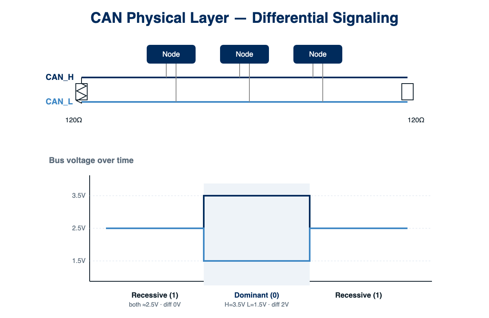
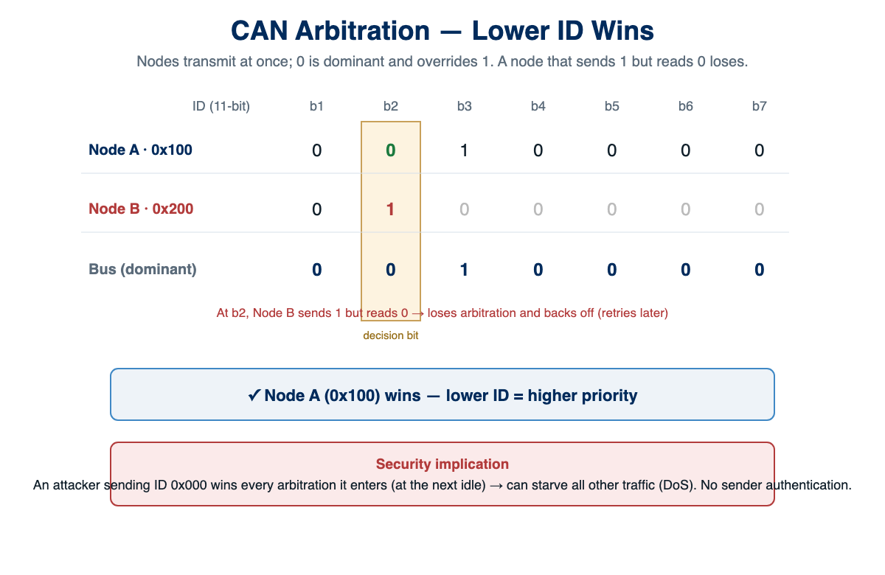

# Class 01 -- CAN Bus Protocol Deep Dive

## Learning Outcomes

- Describe CAN frame structure and arbitration mechanism
- Identify protocol-level security vulnerabilities
- Differentiate Classical CAN, CAN-FD, and NMEA 2000
- Explain why CAN has no built-in authentication

## Definitions

- **CAN** -- Controller Area Network
- **CAN-FD** -- CAN with Flexible Data-rate
- **SOF** -- Start of Frame
- **EOF** -- End of Frame
- **RTR** -- Remote Transmission Request
- **DLC** -- Data Length Code
- **CRC** -- Cyclic Redundancy Check
- **ACK** -- Acknowledgment
- **ECU** -- Electronic Control Unit

## Reading Assignment

- Literature Review: Section 2 (Background: CAN Protocol and Vulnerabilities)
- Hoppe et al. 2008: "Security threats to automotive CAN networks"
- ISO 11898-1 overview (provided excerpt)

## CAN Bus History

- Developed by Bosch in 1986 for automotive applications
- ISO 11898 standard published in 1993
- Designed for reliability and real-time performance
- **Security was NOT a design consideration**

<!--
Instructor Notes:

Key historical context:
- Designed when vehicles were isolated systems
- No external connectivity assumed
- Focus was on reliability in harsh environments
- Security through obscurity (proprietary implementations)

Ask students: "What changed between 1986 and today?"
Expected: Internet connectivity, wireless, autonomous features
-->

## Why CAN for Vessels?

- **Robust**: Designed for harsh automotive environments
- **Real-time**: Deterministic message delivery
- **Low-cost**: Mature technology, cheap components
- **Simple**: Easy to implement
- **Standardized**: NMEA adopted for marine (NMEA 2000)

## CAN Physical Layer

### Differential Signaling



- Two wires: CAN_H and CAN_L
- Differential voltage:
  - Dominant (0): CAN_H=3.5V, CAN_L=1.5V (diff=2V)
  - Recessive (1): Both ~2.5V (diff=0V)
- Noise immunity from differential signaling

### Termination

- 120Ω resistors at each end of bus
- Prevents signal reflection
- Total impedance: 60Ω

<!--
Instructor Notes:

Draw the differential signaling on board.

Key points:
- Dominant ALWAYS wins over recessive
- This is fundamental to arbitration
- Noise affects both wires equally, cancels out

Common issue in labs: Missing termination resistors
- Symptoms: Intermittent communication, bit errors
- Solution: 120Ω between CAN_H and CAN_L at both ends
-->

## CAN Frame Structure

### Standard CAN Frame (11-bit ID)

```
┌─────┬────────────┬─────┬─────┬───────────────────┬───────┬─────┬─────┬─────┐
│ SOF │  ID (11)   │ RTR │ IDE │ DLC (4)           │ DATA  │ CRC │ ACK │ EOF │
│  1  │   bits     │  1  │  1  │ bits              │ 0-64  │ 15  │  2  │  7  │
└─────┴────────────┴─────┴─────┴───────────────────┴───────┴─────┴─────┴─────┘
```

### Extended CAN Frame (29-bit ID)

```
┌─────┬────────────┬─────┬─────┬────────────┬─────┬─────┬───────┬───────┬─────┬─────┐
│ SOF │ ID-A (11)  │ SRR │ IDE │ ID-B (18)  │ RTR │ DLC │ DATA  │  CRC  │ ACK │ EOF │
│  1  │   bits     │  1  │  1  │   bits     │  1  │  4  │ 0-64  │  15   │  2  │  7  │
└─────┴────────────┴─────┴─────┴────────────┴─────┴─────┴───────┴───────┴─────┴─────┘
```

**NMEA 2000 uses Extended CAN (29-bit ID)**

<!--
Instructor Notes:

Draw frame structure on board as you explain each field.

Important fields:
- ID: Determines priority AND message type
- RTR: Remote request (rarely used)
- IDE: 0=Standard, 1=Extended
- DLC: 0-8 bytes in Classical CAN
- DATA: The actual payload
- CRC: Error detection (NOT security!)

Quiz question: "How many data bytes can a standard CAN frame carry?" (8)
-->

## Frame Field Details

| Field | Bits | Purpose |
|-------|------|---------|
| SOF | 1 | Start of Frame (always dominant) |
| ID | 11 or 29 | Message identifier / Priority |
| RTR | 1 | Remote Transmission Request |
| IDE | 1 | Identifier Extension (0=11-bit, 1=29-bit) |
| DLC | 4 | Data Length Code (0-8) |
| DATA | 0-64 | Payload (up to 8 bytes) |
| CRC | 15 | Cyclic Redundancy Check |
| ACK | 2 | Acknowledgment slot + delimiter |
| EOF | 7 | End of Frame (7 recessive bits) |

## Arbitration: How CAN Handles Collisions

Key insight: **Lower ID = Higher Priority**



1. All nodes can transmit simultaneously
2. Each node monitors the bus while transmitting
3. If node transmits recessive but reads dominant → **loses arbitration**
4. Losing node stops and retries later
5. Winning node continues unaware of collision

<!--
Instructor Notes:

This is CRITICAL to understand attacks!

Demo on board:
- Node A sends ID: 0x100 (binary: 00100000000)
- Node B sends ID: 0x200 (binary: 01000000000)
- At bit 2, Node B sends 1 (recessive), reads 0 (dominant)
- Node B loses, backs off
- Node A wins, continues

Security implication:
- Attacker can ALWAYS win by using ID 0x000
- Can starve other messages (DoS attack)
- No authentication of who is transmitting
-->

## Example: Arbitration Battle

```
Time →
        Bit: 10 9 8 7 6 5 4 3 2 1 0
Node A (0x100): 0  0  1  0  0  0  0  0  0  0  0  → WINS
Node B (0x200): 0  1  ← Loses here (sent 1, read 0)
Bus value:      0  0  1  0  0  0  0  0  0  0  0
```

Node B sent recessive (1) at bit 9, but read dominant (0) from the bus.
Node B **stops transmitting** and retries after the bus is idle.

## Security Vulnerabilities

### 1. No Authentication

- Any node can send any message
- No way to verify sender identity
- Receivers accept all messages with matching IDs

<!--
Instructor Notes:

This is the fundamental vulnerability:
- CAN was designed for closed networks
- Assumed all nodes are trusted
- No concept of "who sent this?"

Demo idea: "If I hand you a letter with no return address, would you trust it?"
-->

### 2. No Encryption

- All data transmitted in plaintext
- Anyone on the bus can read all messages
- Sensitive data exposed (positions, speeds, cargo info)

### 3. Broadcast Nature

- All nodes receive all messages
- Eavesdropping is trivial
- No message confidentiality

### 4. Priority-Based DoS

- Attacker can flood with high-priority messages (low ID)
- Legitimate messages starved
- Can cause complete bus failure

### 5. No Timestamps

- No built-in message freshness
- Replay attacks possible
- No way to detect message delay

## CAN-FD: Better but Not Secure

CAN-FD (Flexible Data-rate) improvements:

| Feature | Classical CAN | CAN-FD |
|---------|---------------|--------|
| Max Data | 8 bytes | 64 bytes |
| Max Bitrate | 1 Mbps | 8 Mbps |
| Efficiency | Lower | Higher |
| Security | **None** | **None** |

**CAN-FD does NOT address security vulnerabilities!**

<!--
Instructor Notes:

CAN-FD is newer but still has same security model.

Key point: CAN-FD just makes buses faster, not more secure.

Some secure extensions exist (CAN-SEC) but not widely deployed.
-->

## Attack Taxonomy

From the literature (Section 2.4):

| Attack | Description | Impact |
|--------|-------------|--------|
| **Eavesdropping** | Passive listening | Information disclosure |
| **Spoofing** | Inject fake messages | Control manipulation |
| **Replay** | Retransmit captured messages | Unauthorized actions |
| **DoS (Flooding)** | Overwhelm bus with traffic | Loss of communication |
| **DoS (Bus-off)** | Force error state | Node isolation |
| **Fuzzing** | Random message injection | Unpredictable behavior |

<!--
Instructor Notes:

We will implement several of these in Weeks 6-8!

Key concept: Most attacks require only a $10 USB-CAN adapter.

Quiz question: "Which attack requires no special hardware?" (Eavesdropping)
-->

## Bus-Off Attack

A sophisticated DoS technique:

1. CAN nodes track transmit errors (TEC counter)
2. TEC > 255 → Node enters **Bus-Off state**
3. Attacker deliberately causes errors targeting specific node
4. Victim node isolates itself from network

**Impact**: Can disable specific safety systems!


<!--
Instructor Notes:

This is an advanced attack we may demonstrate.

Requires precise timing and error injection.

Literature: Cho & Shin 2016 discuss this in detail.
-->

## CAN Message Example

Real captured frame:

```
can0  09F80205   [8]  FF FC 02 7C 22 00 FF FF
      │         │   └── 8 data bytes (hex)
      │         └── Data Length Code
      └── 29-bit Extended ID (hex)
```

Breaking down the ID `09F80205`:

```
Binary: 0000 1001 1111 1000 0000 0010 0000 0101

Bits 0-7:   Priority = 00001001 = 2 (high priority)
Bits 8-23:  PGN = varies by message type
Bits 24-31: Source Address = 05
```

<!--
Instructor Notes:

Walk through the decode step by step.

This is NMEA 2000 format - we'll cover PGN structure in Week 3.

Have students practice converting hex to binary.

Quiz question: "What is the source address of this message?" (0x05 = 5)
-->

## Lab Preview: Week 2

In Lab 02, you will:

1. Connect logic analyzer to CAN bus
2. Capture raw CAN signals
3. Decode frames manually (binary → fields)
4. Calculate arbitration winners
5. Inject bit errors and observe behavior

**Tools**: Logic analyzer, can-utils, Python

## Homework

### Required

1. **Read**: Literature Review Section 2 (CAN Protocol and Vulnerabilities)
2. **Read**: ISO 11898-1 overview document (provided)
3. **Practice**: Convert these CAN IDs to binary and identify priority
   - 0x7DF
   - 0x123
   - 0x1A2B3C4D (extended)

### Suggested

- Watch: "CAN Bus Explained" (YouTube - CSS Electronics)
- Read: Hoppe et al. 2008 paper
- Tool: Install can-utils on your Linux system

## Discussion Questions

1. Why did CAN designers not include authentication?
2. How would you add security to CAN without breaking compatibility?
3. What's the trade-off between security and real-time performance?
4. Why might maritime adoption lag behind automotive for CAN security?

## References

- [ISO 11898 Overview]
- [CAN Specification 2.0]
- [Hoppe et al. 2008]
- [CAN-FD Specification]

[ISO 11898 Overview]:https://www.iso.org/standard/63648.html
[CAN Specification 2.0]:https://www.bosch-semiconductors.com/media/ubk_semiconductors/pdf_1/canliteratur/can2spec.pdf
[Hoppe et al. 2008]:https://doi.org/10.1109/WCNC.2008.94
[CAN-FD Specification]:https://www.bosch-semiconductors.com/media/ubk_semiconductors/pdf_1/canliteratur/can_fd_spec.pdf
